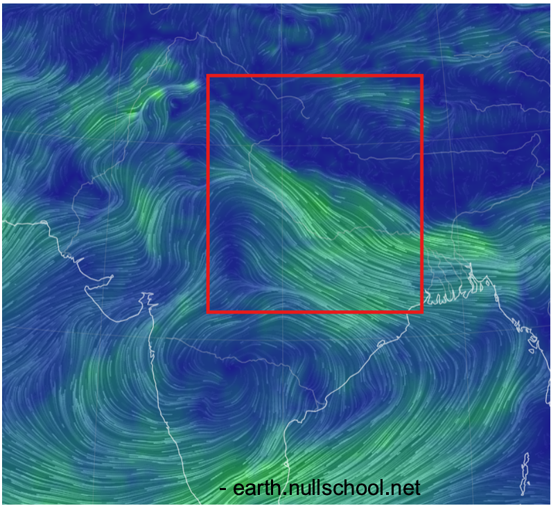

# AtmosRisk Intelligence Platform (ARIP)
   

> **A modular, graph-based atmospheric risk intelligence system for the Indo-Gangetic Plain.**
> Integrates streaming analytics, PCA dimensionality reduction, Kruskal's Maximum Spanning Tree,
> Misra-Gries heavy-hitter detection, bootstrap confidence intervals, and permutation significance
> testing — all visualized through an interactive Plotly/Streamlit dashboard.


<br/>
*Geographic Risk Topology: The platform computes a Kruskal Maximum Spanning Tree backbone overlaid on satellite terrain to track the precise paths of pollution transport across critical nodes.*


<br/>
*Atmospheric Transport & Wind Data: High-fidelity visualizations and network graph analytics allow decision-makers to track the directional flow and dispersion of particulate matter.*

---

## Table of Contents

1. [Overview](#overview)
2. [Features](#features)
3. [Project Structure](#project-structure)
4. [Algorithms & Methods](#algorithms--methods)
5. [Installation](#installation)
6. [Usage](#usage)
7. [Dashboard Sections](#dashboard-sections)
8. [Module Reference](#module-reference)
9. [Tests](#tests)
10. [Configuration](#configuration)
11. [Current Limitation & Real-Time Upgrade Path](#current-limitation--real-time-upgrade-path)
12. [Sensor Network Coverage](#sensor-network-coverage)
13. [Dependencies](#dependencies)

---

## Overview

ARIP monitors 20 sensor nodes across the Indo-Gangetic Plain (Delhi, Patna, Kolkata, and 17 others),
simulates a 7-day sliding telemetry stream of four pollutants (PM2.5, PM10, NO2, SO2), and computes
a **network-propagated risk score** for each city using a spatial graph contagion model.

> **⚠️ Current Limitation — Simulated Data**
> The platform currently runs on **statistically simulated sensor data** seeded for reproducibility.
> The simulation accurately mirrors real Indo-Gangetic pollution patterns (high base PM2.5 for Delhi/NCR,
> sinusoidal day/night cycles, multi-pollutant variance). However, it is not connected to a live feed.
> See [Real-Time Upgrade Path](#current-limitation--real-time-upgrade-path) for how to swap in
> a live API with a single module replacement.

The platform answers three questions:

| Question | Method Used |
|---|---|
| Which cities have the worst pollution right now? | PCA latent index + Risk scoring |
| How does pollution spread geographically? | RBF similarity graph + Kruskal MaxST |
| Which spikes are statistically significant vs. historical baseline? | Bootstrap CI + Permutation test |

---

## Features

- **Streaming Data Simulation** — 7-day telemetry with day/night sinusoidal cycles
- **PCA Dimensionality Reduction** — Compresses 4-pollutant vectors into a single latent Z-index
- **RBF Similarity Graph** — Pairwise city similarity via Radial Basis Function kernel
- **Kruskal's Maximum Spanning Tree** — Extracts the dominant atmospheric transport backbone
- **Alpha-Weighted Risk Propagation** — `risk(i) = α·Z_i + (1-α)·Σ(w_ij·Z_j)`
- **Misra-Gries Heavy Hitters** — Deterministic O(k) memory streaming algorithm for chronic offenders
- **Bootstrap 95% CI** — Non-parametric resampling for PM2.5 mean confidence intervals
- **Permutation Significance Test** — Two-sample test comparing current window vs. historical baseline
- **Interactive Streamlit Dashboard** — Real-time geo map, network graph, trend chart, anomaly alerts
- **CLI Runner** — Headless pipeline with formatted terminal report

---

## Project Structure

```
AtmosRisk-Intelligence-Platform/
│
├── app/
│   ├── streamlit_app.py      # Full interactive Streamlit dashboard
│   └── main.py               # CLI entry point (argparse)
│
├── src/
│   ├── __init__.py           # Public API exports
│   ├── data.py               # DataProcessor + MisraGries streaming class
│   ├── network.py            # AtmosphericNetwork (RBF graph + Kruskal MST)
│   ├── risk.py               # RiskEngine (transport formula) + MisraGries
│   ├── stats.py              # StatisticalValidator (bootstrap CI + permutation)
│   ├── visualization.py      # Plotly chart builders (4 charts)
│   └── utils/
│       ├── __init__.py
│       ├── config.py         # All hyperparameters (alpha, thresholds, seeds)
│       ├── constants.py      # City coordinates, pollutant feature list
│       └── helpers.py        # normalize_positive(), rbf_similarity()
│
├── tests/
│   ├── test.py               # 15 core unit tests
│   └── test_visualization.py # 8 Plotly figure structure tests
│
├── ORIGINAL COMPLETE PROJECT/ # Reference monolithic scripts (code5.py etc.)
├── requirements.txt
└── README.md
```

---

## Algorithms & Methods

### 1. Telemetry Simulation
A 168-hour (7-day) sliding stream is generated for 20 cities. Cities classified as high-risk
(Delhi, Noida, Gurgaon, Patna) use a base PM2.5 of 150 µg/m³; others sample from `Uniform(50, 100)`.
A sinusoidal day/night cycle is added: `cycle = sin(t/24 · 2π) · 20`.

### 2. PCA Latent Pollution Index
The four pollutants are standardized with `StandardScaler`, then compressed to a single component
via Principal Component Analysis. The resulting Z-index is shifted to be strictly positive:

```
Z_index = PCA(StandardScaler([PM25, PM10, NO2, SO2])) - min + 1
```

### 3. RBF Similarity Graph
Pairwise city similarity is computed using the Radial Basis Function (exponential decay) kernel:

```
w_ij = exp(-|Z_i - Z_j|)
```

Edges with `w_ij < threshold` are pruned (sparsification). The resulting graph captures
atmospheric transport likelihood between city pairs.

### 4. Kruskal's Maximum Spanning Tree
The MST backbone is extracted using Kruskal's algorithm on the similarity graph (maximizing weight).
Higher-weight edges represent stronger pollution transport corridors.

### 5. Risk Propagation Formula
The risk score for each city is a convex combination of its local pollution index and
the weighted sum of its neighbours' indices:

```
risk(i) = α · Z_i + (1 - α) · Σ_{j ∈ N(i)} w_ij · Z_j
```

- `α → 1.0`: Local emissions dominate
- `α → 0.0`: Network-transported pollution dominates

### 6. Misra-Gries Heavy Hitters
The Misra-Gries algorithm maintains exactly `k-1` counters and deterministically identifies
the top-k most frequent items in a stream using O(k) space and O(n) time. Applied here to
count cities exceeding the severe PM2.5 threshold (>150 µg/m³).

### 7. Bootstrap Confidence Interval
For each city's current window PM2.5 values, B=500 bootstrap resamples are drawn.
The 2.5th and 97.5th percentiles of bootstrap means form the 95% CI.

### 8. Permutation Significance Test
Tests whether the current 24h window mean is significantly different from the historical baseline:

1. Compute observed difference: `d = mean(current) - mean(historical)`
2. Pool both samples and permute B=1000 times
3. `p-value = P(permuted_diff ≥ d)`

`p < 0.05` → anomaly flagged 🚨

---

## Installation

**Prerequisites:** Python 3.9+

```bash
# Clone the repository
git clone https://github.com/your-username/AtmosRisk-Intelligence-Platform.git
cd AtmosRisk-Intelligence-Platform

# Create and activate a virtual environment (recommended)
python -m venv venv

# Windows
venv\Scripts\activate

# macOS / Linux
source venv/bin/activate

# Install dependencies
pip install -r requirements.txt
```

---

## Usage

### Run the Interactive Dashboard

```bash
streamlit run app/streamlit_app.py
```

Opens in your browser at `http://localhost:8501`

### Run the CLI Pipeline

```bash
# Default settings (epoch=167, alpha=0.7, threshold=0.2)
python app/main.py

# Custom settings
python app/main.py --hour 120 --alpha 0.6 --threshold 0.3 --top 10
```

**CLI Arguments:**

| Argument | Default | Description |
|---|---|---|
| `--hour` | `167` | Current epoch (24–167). Right boundary of the 24h sliding window |
| `--alpha` | `0.7` | Local vs. transport weight α |
| `--threshold` | `0.2` | RBF graph sparsification threshold |
| `--top` | `10` | Number of top-risk cities to display |

### Import as a Python Package

```python
from src.data import DataProcessor
from src.network import AtmosphericNetwork
from src.risk import RiskEngine, MisraGries
from src.stats import StatisticalValidator

# Generate data
processor = DataProcessor()
df_master = processor.generate_telemetry_stream()
df_window = processor.get_window(df_master, current_hour=167)
pca_df    = processor.compute_pca(df_window)

# Build network
net     = AtmosphericNetwork(threshold=0.2)
sim_df  = net.compute_similarity_matrix(pca_df)
net.build_graph(sim_df)
mst     = net.maximum_spanning_tree()

# Compute risk
engine   = RiskEngine(alpha=0.7)
risk_df, risk_scores = engine.run(mst, pca_df)

# Statistical inference
validator   = StatisticalValidator()
city_stats  = validator.compute_all("Delhi", df_window, df_master, 167)
print(city_stats)
# {'ci_low': 140.8, 'ci_high': 158.5, 'p_val': 0.726, 'status': '✅ Stable'}

# Heavy hitters
df_hitters = MisraGries.from_dataframe(df_master, k=6, threshold=150)
print(df_hitters)
```

---

## Dashboard Sections

| Section | Description |
|---|---|
| **Sidebar** | Current epoch slider (h24–h167), α slider, sparsification threshold |
| **KPI Bar** | Cities monitored · MST nodes · MST edges · Anomaly count · Window range |
| **Spatial Propagation Map** | Plotly Scattermapbox: teal MST transport edges + YlOrRd risk-coloured nodes |
| **Abstract Graph Topology** | Force-directed spring layout of MST; node size ∝ risk score |
| **Temporal Contagion Trend** | 72-hour trailing PM2.5 time-series for top-4 risk hubs |
| **Latent Risk Distribution** | Horizontal bar chart ranking all 20 cities by risk score |
| **Misra-Gries Heavy Hitters** | Top-k chronic PM2.5 offenders (deterministic streaming algorithm) |
| **Statistical Validation** | Anomaly table (p < 0.05) + full CI/p-value expandable table |

---

## Module Reference

### `src.data.DataProcessor`
| Method | Description |
|---|---|
| `generate_telemetry_stream()` | Returns 168h × 20-city DataFrame with PM2.5, PM10, NO2, SO2 |
| `get_window(df, current_hour, window_size=24)` | Extracts rolling 24h window |
| `compute_pca(df_window)` | Returns DataFrame with Z_index per city |

### `src.network.AtmosphericNetwork`
| Method | Description |
|---|---|
| `compute_similarity_matrix(pca_df)` | n(n-1)/2 pairwise RBF similarity DataFrame |
| `build_graph(similarity_df)` | Builds NetworkX Graph with edge weight threshold |
| `maximum_spanning_tree()` | Returns Kruskal MaxST as NetworkX Graph |
| `network_statistics(graph)` | Returns nodes, edges, density, avg degree |

### `src.risk.RiskEngine`
| Method | Description |
|---|---|
| `compute_risk_scores(graph, pca_df)` | Returns `dict[city → risk_score]` |
| `risk_dataframe(risk_scores, pca_df)` | Returns ranked DataFrame |
| `run(graph, pca_df)` | Full pipeline: returns `(risk_df, risk_scores)` |

### `src.risk.MisraGries`
| Method | Description |
|---|---|
| `fit(stream)` | Process item stream, maintain k-1 counters |
| `heavy_hitters()` | Returns sorted counter dict |
| `from_dataframe(df, k, threshold)` | Class method: build stream from PM2.5 threshold breaches |

### `src.stats.StatisticalValidator`
| Method | Description |
|---|---|
| `bootstrap_ci(city_data, B=500)` | Returns `(ci_low, ci_high)` |
| `permutation_test(curr_pm, hist_pm, B=1000)` | Returns p-value |
| `compute_all(city, df_window, df_master, hour)` | Returns `{ci_low, ci_high, p_val, status}` |

### `src.visualization`
| Function | Description |
|---|---|
| `build_geo_map(graph, risk_scores, stat_results)` | Plotly Scattermapbox geographic risk map |
| `build_trend_chart(df_master, risk_scores, hour)` | 72h PM2.5 trend for top-k cities |
| `build_risk_bar(risk_scores)` | Horizontal YlOrRd ranking bar chart |
| `build_network_graph(graph, risk_scores)` | Spring-layout abstract network topology |

---

## Tests

```bash
# Core pipeline tests (15 tests)
python tests/test.py

# Visualization tests (8 tests)
python tests/test_visualization.py
```

**Test coverage:**

| Module | Tests | Coverage |
|---|---|---|
| `DataProcessor` | stream shape, reproducibility, window, PCA | 4 |
| `AtmosphericNetwork` | similarity matrix, spanning forest, node coverage | 3 |
| `RiskEngine` | positive scores, DataFrame columns, high-risk ranking | 3 |
| `MisraGries` | heavy hitter detection, known cities | 1 |
| `StatisticalValidator` | CI bounds, anomaly detection, null case, key validation | 4 |
| `visualization` | figure types, trace counts, node counts, bar ordering | 8 |
| **Total** | | **23 / 23** |

---

## Configuration

All hyperparameters are centralized in [`src/utils/config.py`](src/utils/config.py):

```python
RANDOM_SEED          = 42
WINDOW_HOURS         = 168      # Total simulation hours (7 days)
SLIDING_WINDOW       = 24       # Rolling window size
DEFAULT_ALPHA        = 0.7      # Local vs. transport weight
DEFAULT_EDGE_THRESHOLD = 0.20   # RBF sparsification cutoff
PCA_COMPONENTS       = 1
BOOTSTRAP_ITERATIONS = 500
PERMUTATION_ITERATIONS = 1000
MISRA_GRIES_K        = 4        # Number of heavy-hitter counters
SEVERE_PM25_THRESHOLD = 150     # µg/m³ breach threshold
```

---

## Sensor Network Coverage

20 Indo-Gangetic Plain cities:

| Region | Cities |
|---|---|
| Punjab / Haryana | Amritsar, Ludhiana, Chandigarh, Gurgaon |
| NCR | Delhi, Noida, Meerut |
| UP | Agra, Kanpur, Lucknow, Varanasi |
| Bihar | Patna, Gaya, Muzaffarpur |
| West Bengal | Kolkata, Asansol, Siliguri |
| Rajasthan / MP | Jaipur, Gwalior, Bhopal |

---

## Dependencies

```
streamlit      — Interactive web dashboard
numpy          — Numerical computation
pandas         — DataFrame operations
scikit-learn   — PCA + StandardScaler
networkx       — Graph construction + Kruskal MST
plotly         — Interactive visualizations (Scattermapbox, line, bar)
scipy          — Scientific utilities
matplotlib     — Fallback plotting
```

---

## Current Limitation & Real-Time Upgrade Path

### The Limitation

The project currently uses a **statistical simulation** of sensor data:

```python
# src/data.py  — what runs today
def generate_telemetry_stream(self):
    np.random.seed(42)
    # ... synthetic PM2.5, PM10, NO2, SO2 per city ...
    return pd.DataFrame(data)
```

This is intentional for reproducibility, offline use, and algorithm demonstration.
But the simulation is a **drop-in placeholder** — the entire downstream pipeline
(PCA → Graph → MST → Risk → Stats → Dashboard) is completely agnostic to where the data comes from.

---

### The Plug-In Architecture

Because of the modular design, **only one method needs to change** to go real-time.
Every module downstream receives a standard DataFrame with these columns:

```
city | hour | PM25 | PM10 | NO2 | SO2
```

As long as any data source returns that shape, the entire platform runs on live data.

```
[Simulation / Live API]
         ↓
  DataProcessor.generate_telemetry_stream()   ← ONLY THIS CHANGES
         ↓
  PCA Latent Index
         ↓
  RBF Similarity Graph
         ↓
  Kruskal Maximum Spanning Tree
         ↓
  Alpha-Weighted Risk Propagation
         ↓
  Bootstrap CI + Permutation Test
         ↓
  Interactive Dashboard                        ← UNCHANGED
```

---

### Available Real-Time Data Sources for India

| Source | Coverage | Cost | Pollutants | API Type |
|---|---|---|---|---|
| **OpenAQ v3** | 20+ Indian cities | Free (API key) | PM2.5, PM10, NO2, SO2, O3 | REST |
| **AQICN / Waqi** | Pan-India CPCB feed | Free (token) | PM2.5, PM10, NO2, SO2, CO | REST |
| **IQAir AirVisual** | Major Indian metros | Free tier (limited) | PM2.5, AQI | REST |
| **CPCB Data Portal** | Official India govt. | Free (scraping) | Full AQI parameters | HTML/CSV |
| **Sentinel-5P (ESA)** | Satellite, national | Free | NO2, SO2, CO (column) | GEE / netCDF |

---

### How to Plug In a Live Source

Create a new file `src/ingestion.py` and write a fetcher class that returns the same DataFrame shape:

```python
# src/ingestion.py  — example using OpenAQ v3
import requests
import pandas as pd
from datetime import datetime, timedelta

OPENAQ_API_KEY = "your_key_here"  # https://explore.openaq.org/

# Map your city names to OpenAQ location IDs (look up via /v3/locations?country=IN)
CITY_LOCATION_IDS = {
    "Delhi":   8118,
    "Patna":   8200,
    "Kolkata": 8150,
    # ... add remaining cities
}

class OpenAQFetcher:
    """
    Drop-in replacement for DataProcessor.generate_telemetry_stream().
    Fetches last 168 hours of real sensor data from OpenAQ v3 API.
    Returns a DataFrame with the same schema expected by the pipeline.
    """

    BASE_URL = "https://api.openaq.org/v3"
    HEADERS  = {"X-API-Key": OPENAQ_API_KEY}

    def generate_telemetry_stream(self):
        records = []
        date_to   = datetime.utcnow()
        date_from = date_to - timedelta(hours=168)

        for city, location_id in CITY_LOCATION_IDS.items():
            url = f"{self.BASE_URL}/locations/{location_id}/measurements"
            params = {
                "date_from": date_from.isoformat(),
                "date_to":   date_to.isoformat(),
                "limit":     500,
            }
            resp = requests.get(url, headers=self.HEADERS, params=params)
            data = resp.json().get("results", [])

            # Pivot API response into pipeline-compatible row format
            hourly = {}
            for reading in data:
                hour = int((datetime.fromisoformat(
                    reading["period"]["datetimeFrom"]["utc"].replace("Z", "")
                ) - date_from).total_seconds() // 3600)
                param = reading["parameter"]["name"].upper()   # pm25 → PM25
                hourly.setdefault(hour, {"city": city, "hour": hour})
                hourly[hour][param] = reading["value"]

            for row in hourly.values():
                # Fill any missing pollutants with NaN or a safe default
                row.setdefault("PM25", float("nan"))
                row.setdefault("PM10", float("nan"))
                row.setdefault("NO2",  float("nan"))
                row.setdefault("SO2",  float("nan"))
                records.append(row)

        return pd.DataFrame(records).dropna()
```

Then in `app/streamlit_app.py`, swap one line:

```python
# BEFORE (simulation)
from src.data import DataProcessor
df_master = DataProcessor().generate_telemetry_stream()

# AFTER (live data)
from src.ingestion import OpenAQFetcher
df_master = OpenAQFetcher().generate_telemetry_stream()
```

**Nothing else changes.** The entire PCA, graph, risk, and stats pipeline operates on the live data immediately.

---

### Auto-Refresh for True Real-Time

Add this to `app/streamlit_app.py` to make the dashboard poll live data every 30 minutes:

```python
import streamlit as st

# At the top of the app, before data loading
st.markdown("⏱️ Dashboard auto-refreshes every 30 minutes")
st_autorefresh = st.empty()

# Use Streamlit's fragment API or a simple rerun timer
if "last_refresh" not in st.session_state:
    st.session_state.last_refresh = 0

import time
if time.time() - st.session_state.last_refresh > 1800:  # 30 min
    st.session_state.last_refresh = time.time()
    st.cache_data.clear()   # Clear cached telemetry
    st.rerun()              # Force full dashboard recompute
```

---

### What You Get With Real Data

| Capability | Simulation | + Real-Time Data |
|---|---|---|
| Risk scoring | Supported | Supported |
| Graph topology | Supported | Supported |
| Anomaly detection | vs. synthetic history | vs. real historical baseline |
| Heavy hitters | Supported | actual breach counts |
| Trend chart | synthetic cycles | real pollution events |
| Geo map | Supported | Supported |
| **Decision utility** | Academic / demo | **Operational / policy** |

---

## License

This project is for academic and research purposes. 
